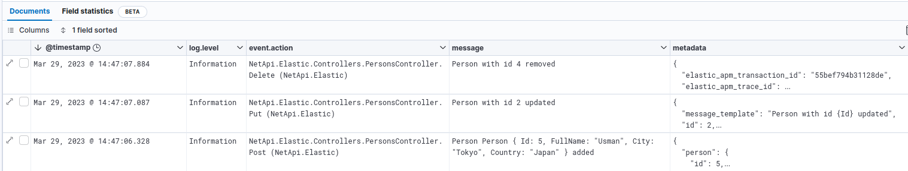
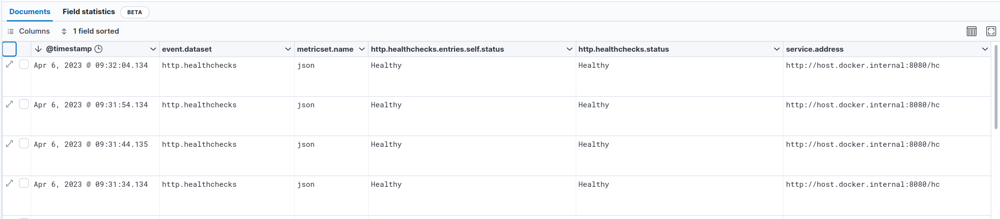
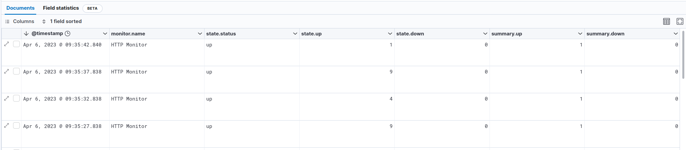
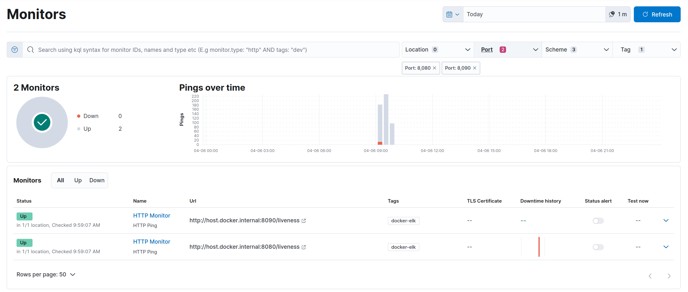
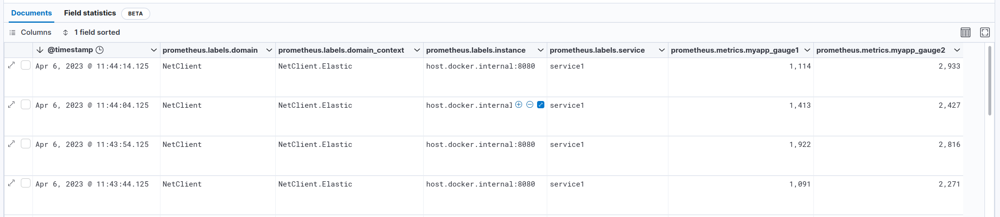
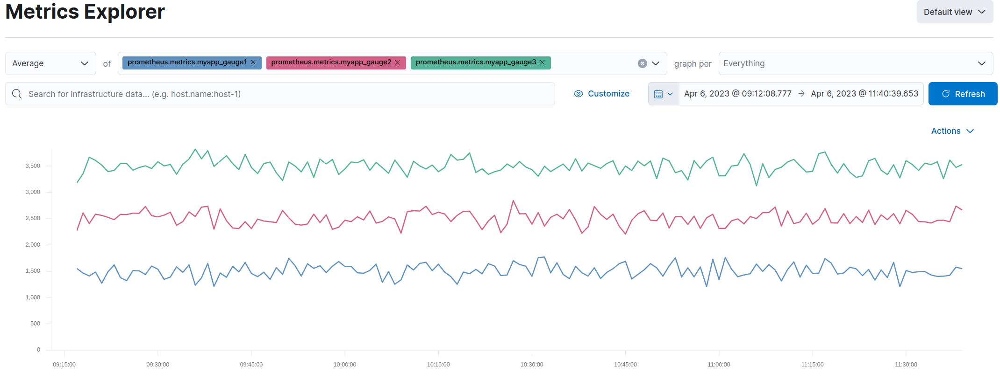

- [Context](#context)
- [Logs (via Serilog)](#logs-via-serilog)
  - [What is Serilog?](#what-is-serilog)
  - [NuGet packages](#nuget-packages)
  - [Serilog implementation](#serilog-implementation)
  - [Serilog configuration](#serilog-configuration)
  - [Writing logs](#writing-logs)
  - [Sending logs to Elasticsearch](#sending-logs-to-elasticsearch)
  - [Analyse logs in Kibana](#analyse-logs-in-kibana)
- [Health checks (via Microsoft AspNetCore HealthChecks)](#health-checks-via-microsoft-aspnetcore-healthchecks)
  - [What are health checks?](#what-are-health-checks)
  - [NuGet packages](#nuget-packages-1)
  - [Health checks implementation](#health-checks-implementation)
  - [Sending health checks to Elasticsearch](#sending-health-checks-to-elasticsearch)
  - [Analyse health checks in Kibana](#analyse-health-checks-in-kibana)
- [Metrics (via Prometheus)](#metrics-via-prometheus)
  - [What is Prometheus?](#what-is-prometheus)
  - [NuGet packages](#nuget-packages-2)
  - [Prometheus implementation](#prometheus-implementation)
  - [Forward Health checks to Prometheus](#forward-health-checks-to-prometheus)
  - [Business metrics](#business-metrics)
  - [Sending metrics to Elasticsearch](#sending-metrics-to-elasticsearch)
  - [Analyse metrics in Kibana](#analyse-metrics-in-kibana)
- [Traces (via Elastic APM agent)](#traces-via-elastic-apm-agent)
  - [What is Elastic APM agent?](#what-is-elastic-apm-agent)
  - [Supported technologies](#supported-technologies)
  - [Elastic APM Implementation](#elastic-apm-implementation)
    - [Profiler auto instrumentation](#profiler-auto-instrumentation)
    - [NuGet](#nuget)
    - [Zero code change setup](#zero-code-change-setup)
    - [.Net Core NuGet setup](#net-core-nuget-setup)

# Context

The purpose of this application is to show how to integrate:

- logs (via Serilog)
- health checks (via Microsoft AspNetCore HealthChecks)
- business metrics (via Prometheus) 
- traces (via Elastic APM)
  
to an Elasticsearch cluster with .Net.

There are two projects :

- NetApi.Elastic : a Web API that exposes mainly an endpoint /persons and also a swagger endpoint in Development mode
- NetClient.Elastic : a Web client with some razor pages on / and a persons view which interact with NetApi.Elastic

# Logs (via Serilog)

## What is Serilog?

Like many other libraries for .NET, Serilog provides diagnostic logging to files, the console, and elsewhere. It is easy to set up, has a clean API, and is portable between recent .NET platforms. Unlike other logging libraries, Serilog is built with powerful structured event data in mind.

Source : [Serilog.net](https://serilog.net/)

## NuGet packages

Following Serilog NuGet packages are used to immplement logging: 

- [Serilog.AspNetCore](https://github.com/serilog/serilog-aspnetcore): routes ASP.NET Core log messages through Serilog.

- [Serilog.Enrichers.Environment](https://github.com/serilog/serilog-enrichers-environment): enriches Serilog events with information from the process environment.

- [Serilog.Settings.Configuration](https://github.com/serilog/serilog-settings-configuration): reads configuration from Microsoft.Extensions.Configuration sources, including .NET Core's appsettings.json file.

- [Serilog.Sinks.Console](https://github.com/serilog/serilog-sinks-console): writes log events to the Windows Console or an ANSI terminal via standard output.

Following Elastic NuGet package is used to properly format logs for Elasticsearch:

- [Elastic.CommonSchema.Serilog](https://github.com/elastic/ecs-dotnet): formats a Serilog event into a JSON representation that adheres to the Elastic Common Schema.

## Serilog implementation

First, you have to add the following packages in your csproj file (you can update the version to the latest available for your .Net version).

    <PackageReference Include="Elastic.CommonSchema.Serilog" Version="1.5.3" />
    <PackageReference Include="Serilog.AspNetCore" Version="6.1.0" />
    <PackageReference Include="Serilog.Enrichers.Environment" Version="2.2.0" />
    <PackageReference Include="Serilog.Settings.Configuration" Version="3.4.0" />
    <PackageReference Include="Serilog.Sinks.Console" Version="4.1.0" />

Then, you have to define Serilog as your log provider. In your Program.cs file, add the ConfigureLogging and UseSerilog as described below: 

    public static IHost BuildHost(string[] args) =>
            Host.CreateDefaultBuilder(args)
                .ConfigureLogging((host, builder) => builder.ClearProviders().AddSerilog(host.Configuration))
                .UseSerilog()
                .UseServiceProviderFactory(new AutofacServiceProviderFactory())
                .ConfigureWebHostDefaults(webBuilder => webBuilder.UseStartup<Startup>())
                .Build();

The UseSerilog method sets Serilog as the logging provider. The AddSerilog method is a custom extension which will add Serilog to the logging pipeline and read the configuration from host configuration:

    public static ILoggingBuilder AddSerilog(this ILoggingBuilder builder, IConfiguration configuration)
    {
        Log.Logger = new LoggerConfiguration()
            .ReadFrom.Configuration(configuration)
            .CreateLogger();

        builder.AddSerilog();

        return builder;
    }

When using the default middleware for HTTP request logging, it will write HTTP request information like method, path, timing, status code and exception details in several events. To avoid this and use streamlined request logging, you can use the middleware provided by Serilog. Add UseSerilogRequestLogging in Startup.cs before any handlers whose activities should be logged.

    public void Configure(IApplicationBuilder app)
    {
        app.UseRouting();
        app.UseSerilogRequestLogging();

        app.UseEndpoints(endpoints =>
        {
            /// ...
        });

        // ...
    }

## Serilog configuration 

As the Serilog configuration is read from host configuration, we will now set all configuration we need to the appsettings file.

In Production environment, we will prepare logs for Elasticsearch ingestion, so use JSON format and add all needed information to logs. 

    {
        "Serilog": {
            "Using": [],
            "MinimumLevel": {
                "Default": "Warning",
                "Override": {
                    "Microsoft.Hosting": "Information",
                    "NetClient.Elastic": "Information"
                }
            },
            "Enrich": ["FromLogContext", "WithMachineName", "WithEnvironmentUserName", "WithEnvironmentName", "WithProcessId", "WithThreadId"],
            "Properties": {
                "Domain": "NetClient",
                "DomainContext": "NetClient.Elastic"
            },
            "WriteTo": [
                { 
                    "Name": "Console",
                    "Args": {
                        "formatter": "Elastic.CommonSchema.Serilog.EcsTextFormatter, Elastic.CommonSchema.Serilog"
                    }
                }
            ]
        },
        // ...
    }

This configuration will:

- set default log level to Warning except for "Microsoft.Hosting" and "NetClient.Elastic" (our application) namespaces which will be Information
- enrich log with log context, machine name, and some other useful data when available
- add custom properties to each log event : Domain and DomainContext
- write logs to console, using the Elastic JSON formatter for Serilog

In Development environment, generally, we won't want to display our logs in JSON format and we will prefer having minimal log level to Debug for our application, so, we will override this in the appsettings.Development.json file:

    {
        "Serilog": {
            "MinimumLevel": {
                "Override": {
                    "NetClient.Elastic": "Debug"
                }
            },
            "WriteTo": [
                { 
                    "Name": "Console",
                    "Args": {
                        "outputTemplate": "-> [{Timestamp:HH:mm:ss} {Level:u3}] {Message:lj}{NewLine}{Exception}"
                    }
                }
            ]
        }
    }

## Writing logs

Serilog is configured to use *Microsoft.Extensions.Logging.ILogger* interface. You can retrieve an instance of ILogger anywhere in your code with .Net IoC container:

    public PersonsController(ILogger<PersonsController> logger)
    {
        _logger = logger;
    }

You can add a simple log by using:

    _logger.LogDebug("Getting persons");

Serilog supports destructuring, allowing simple property or complex objects to be passed as parameters in your logs:

    # with a simple property:
    _logger.LogInformation("Person with id {Id} updated", id);

    # with a complex object:
    _logger.LogInformation("Person {@person} added", person);

This can be very useful for example in a CQRS application to log queries and commands.

See [Serilog documentation](https://github.com/serilog/serilog/wiki) for all information.

In some case, you don't want a field from a complex object to be stored in you logs (for example, a password in a login command) or you may want to store the field with another name in your logs. You can use the NuGet [Destructurama.Attributed](https://github.com/destructurama/attributed) for these use cases.

Add the NuGet in your csproj:

    <PackageReference Include="Destructurama.Attributed" Version="3.0.0" />

Update the logger configuration in the AddSerilog extension method with the *.Destructure.UsingAttributes()* method:

    Log.Logger = new LoggerConfiguration()
        .ReadFrom.Configuration(configuration)
        .Destructure.UsingAttributes()
        .CreateLogger();

You can now add any attributes from Destructurama as [NotLogged] on your properties:

    [NotLogged]
    public string Password { get; set; }

## Sending logs to Elasticsearch

All the logs are written in the console, and, as we use docker to deploy our application, they will be readable by using:

    docker container logs netclient-elastic

To send the logs to Elasticseach, you will have to configure a filebeat agent (for example, with docker autodiscover):

    filebeat.autodiscover:
        providers:
            - type: docker
            hints.enabled: true
            hints.default_config:
                type: container
                paths:
                - /var/lib/docker/containers/${data.container.id}/*.log
                processors:
                  - decode_json_fields:
                        fields: ["message"]
                        process_array: false
                        max_depth: 1
                        target: ""
                        overwrite_keys: true
                        add_error_key: true

But if your logs are stored on the filesystem, you can easily use the filestream input of filebeat.

For more information about this filebeat configuration, you can have a look to : https://github.com/ijardillier/docker-elk/blob/master/extensions/beats/filebeat/config/filebeat.yml

## Analyse logs in Kibana

You can check how logs are ingested in the Discover module:

Fields present in our logs and compliant with ECS are automatically set (@timestamp, log.level, event.action, message, ...) thanks to the EcsTextFormatter.
Added fields like *domain*, *domain_context*, *id* or *person* in our logs are stored in the metadata object (flattened).

The log level is dependant of the method used in the code (Verbose, Debug, Information, Warning, Error, Fatal). It is stored as keyword so you can easily use it for filtering, aggregation, .... You can find all error logs with (in KQL):

    log.level: "Error"

We can see that, for the added action log, Serilog automatically generate *message* field with all properties defined in the person instance (except the Email property, which is tagged as *NotLogged*), due to destructuring. In this case, metadata are stored as following:

    {
        "message_template": "Person {@person} added",
        "request_id": "0HMPG79NSQK0U:00000008",
        "connection_id": "0HMPG79NSQK0U",
        "environment_name": "Production",
        "elastic_apm_transaction_id": "260cc4ce2c425d5b",
        "domain_context": "NetApi.Elastic",
        "person": {
            "id": 7,
            "full_name": "Anil",
            "city": "Tokyo",
            "country": "Japan",
            "$type": "Person"
        },
        "request_path": "/api/v1.0/persons",
        "elastic_apm_trace_id": "5a2e6f2ccb298b5b2eeea36772933094",
        "domain": "NetApi"
    }

This field is queryable by using, for example (in KQL):

    metadata.person.country : "Japan"

# Health checks (via Microsoft AspNetCore HealthChecks)

## What are health checks?

ASP.NET Core offers Health Checks Middleware and libraries for reporting the health of app infrastructure components.

Health checks are exposed by an app as HTTP endpoints. Health check endpoints can be configured for various real-time monitoring scenarios:

- Health probes can be used by container orchestrators and load balancers to check an app's status. For example, a container orchestrator may respond to a failing health check by halting a rolling deployment or restarting a container. A load balancer might react to an unhealthy app by routing traffic away from the failing instance to a healthy instance.
- Use of memory, disk, and other physical server resources can be monitored for healthy status.
- Health checks can test an app's dependencies, such as databases and external service endpoints, to confirm availability and normal functioning.

Health checks are typically used with an external monitoring service or container orchestrator to check the status of an app. Before adding health checks to an app, decide on which monitoring system to use. The monitoring system dictates what types of health checks to create and how to configure their endpoints.

Source : [Health checks in ASP.NET Core](https://learn.microsoft.com/en-us/aspnet/core/host-and-deploy/health-checks?view=aspnetcore-6.0)

## NuGet packages

Following Xabaril NuGet package is used:

- [AspNetCore.HealthChecks.UI.Client](https://github.com/Xabaril/AspNetCore.Diagnostics.HealthChecks#configuration): formats health checks endpoint response in a JSON representation.

There are a lot of NuGet packages provided by [Xabaril](https://github.com/Xabaril/AspNetCore.Diagnostics.HealthChecks) which can help you to add health checks for your application dependencies: Azure services, databases, events bus, network, ...

## Health checks implementation

First, you have to add the following packages in your csproj file (you can update the version to the latest available for your .Net version):

    <PackageReference Include="AspNetCore.HealthChecks.UI.Client" Version="6.0.5" />

Then, you have to register the HealthCheck service. This is done here in a custom extension which is used in the ConfigureServices of the Startup file:

    public virtual void ConfigureServices(IServiceCollection services)
    {
        // ...
        services.AddCustomHealthCheck(Configuration)
        // ...     
    }

    public static IServiceCollection AddCustomHealthCheck(this IServiceCollection services, IConfiguration configuration)
    {
        IHealthChecksBuilder hcBuilder = services.AddHealthChecks();
        hcBuilder.AddCheck("self", () => HealthCheckResult.Healthy());
        return services;
    }

This "self" check is just here to say that if the endpoint responds (the application is alive). You can also manage Unhealthy and Degraded mode if needed.

The third step is to map endpoints for health checks:

    public void Configure(IApplicationBuilder app)
    {
        app.UseRouting();
        // ...

        app.UseEndpoints(endpoints =>
        {
            endpoints.MapHealthChecks("/liveness", new HealthCheckOptions
            {
                Predicate = r => r.Name.Contains("self")
            });

            endpoints.MapHealthChecks("/hc", new HealthCheckOptions()
            {
                Predicate = _ => true,
                ResponseWriter = UIResponseWriter.WriteHealthCheckUIResponse
            });
        });
    }

The first map exposes the /liveness endpoint with the self check described in the previous section.

The result of a call to http://localhost:8080/liveness will just be:

    Status code : 200 (Ok)
    Content : Healthy

The second map exposes the /hc endpoint with an aggregation of all health checks defined in a JSON format.

The result of a call to http://localhost:8080/hc will be:

    Status code : 200 (Ok)
    Content : {"status":"Healthy","totalDuration":"00:00:00.0027779","entries":{"self":{"data":{},"duration":"00:00:00.0008869","status":"Healthy","tags":[]}}}

## Sending health checks to Elasticsearch

All the health checks are available on the /hc endpoint.

To send the health checks to Elasticseach, you will have to configure a metricbeat agent with http module:

    metricbeat.modules:
    - module: http
      metricsets:
      - json
      period: 10s
      hosts: ["host.docker.internal:8080"]
      namespace: "healthcheck"
      path: "/hc"
  
For more information about this metricbeat configuration, you can have a look to: https://github.com/ijardillier/docker-elk/blob/master/extensions/beats/metricbeat/config/metricbeat.yml

You can also use heartbeat agent and the /liveness endpoint in order to use the Uptime app in Kibana:

    heartbeat.monitors:
    - type: http
      id: http-monitor
      name: HTTP Monitor
      schedule: '@every 5s' # every 5 seconds from start of beat
      urls: 
      - "http://host.docker.internal:8080/liveness"

For more information about this heartbeat configuration, you can have a look to: https://github.com/ijardillier/docker-elk/blob/master/extensions/beats/heartbeat/config/heartbeat.yml

When using Prometheus, it is possible to forward health checks metrics to Prometheus endpoint, and retrieve it with the same configuration of metricbeat, in a prometheus module. We will implement this in the next article.

## Analyse health checks in Kibana

You can check how health checks are ingested in the Discover module:

With Metricbeat:

With Heartbeat:

You can see how health checks are displayed in the Uptime App:

# Metrics (via Prometheus)

## What is Prometheus?

Prometheus collects and stores its metrics as time series data, i.e. metrics information is stored with the timestamp at which it was recorded, alongside optional key-value pairs called labels.

Source : [Prometheus](https://prometheus.io/)

## NuGet packages

The following Prometheus for .Net NuGet packages are used:

- [prometheus-net](https://github.com/prometheus-net/prometheus-net)
- [prometheus-net.AspNetCore](https://github.com/prometheus-net/prometheus-net#aspnet-core-exporter-middleware)
- [prometheus-net.AspNetCore.HealthChecks](https://github.com/prometheus-net/prometheus-net#aspnet-core-health-check-status-metrics)

These are .NET libraries for instrumenting your applications and exporting metrics to Prometheus.

## Prometheus implementation

First, you have to add the following packages in your csproj file (you can update the version to the latest available for your .Net version):

    <PackageReference Include="prometheus-net" Version="8.0.0" />
    <PackageReference Include="prometheus-net.AspNetCore" Version="8.0.0" />
    <PackageReference Include="prometheus-net.AspNetCore.HealthChecks" Version="8.0.0" />

By default, Prometheus .Net library add some application metrics about .Net (Memory, CPU, garbaging, ...). As we plan to use APM agent, we don't want it to add this metrics, so we can suppress them. We will also add some static labels to each metrics in order to be able to add contextual information from our application, as we did it for logs:

    public virtual void ConfigureServices(IServiceCollection services)
    {
        // ...

        Metrics.SuppressDefaultMetrics();

        Metrics.DefaultRegistry.SetStaticLabels(new Dictionary<string, string>
        {
            { "domain", "NetClient" },
            { "domain_context", "NetClient.Elastic" }
        });

        // ...     
    }

We also have to map endpoints for metrics:

    public void Configure(IApplicationBuilder app)
    {
        // ...

        app.UseEndpoints(endpoints =>
        {
            // ...

            endpoints.MapMetrics();
        });
    }

This map exposes the /metrics endpoint with the Prometheus format.
If you need OpenMetrics format, you can easily access it with /metrics?accept=application/openmetrics-text

The result is the below:

    # HELP aspnetcore_healthcheck_status ASP.NET Core health check status (0 == Unhealthy, 0.5 == Degraded, 1 == Healthy)
    # TYPE aspnetcore_healthcheck_status gauge
    aspnetcore_healthcheck_status{name="self",domain="NetClient",domain_context="NetClient.Elastic"} 1
    # HELP myapp_gauge1 A simple gauge 1
    # TYPE myapp_gauge1 gauge
    myapp_gauge1{service="service1",domain="NetClient",domain_context="NetClient.Elastic"} 1028
    # HELP myapp_gauge2 A simple gauge 2
    # TYPE myapp_gauge2 gauge
    myapp_gauge2{service="service1",domain="NetClient",domain_context="NetClient.Elastic"} 2403
    # HELP myapp_gauge3 A simple gauge 3
    # TYPE myapp_gauge3 gauge
    myapp_gauge3{service="service1",domain="NetClient",domain_context="NetClient.Elastic"} 3872
    ...

## Forward Health checks to Prometheus

We can easily forward our health checks (described previously) to Prometheus endpoint, to avoid using http module from Metricbeat and retrieve all metrics including health checks from Metricbeat Prometheus module. By the way, we will also benefit from our static labels if defined.

This is done here in our custom extension which is used in the ConfigureServices of the Startup file:

    public virtual void ConfigureServices(IServiceCollection services)
    {
        // ...
        services.AddCustomHealthCheck(Configuration)
        // ...     
    }

    public static IServiceCollection AddCustomHealthCheck(this IServiceCollection services, IConfiguration configuration)
    {
        IHealthChecksBuilder hcBuilder = services.AddHealthChecks();
        hcBuilder.AddCheck("self", () => HealthCheckResult.Healthy());

        hcBuilder.ForwardToPrometheus();

        return services;
    }

## Business metrics

Prometheus .Net library offers an easy way to add business metrics.

To create a new metric, you just have to instantiate an new counter, gauge, ...:

    private readonly Gauge Gauge1 = Metrics.CreateGauge("myapp_gauge1", "A simple gauge 1");

If you need to add attached labels, you have to add a configuration:

    private static readonly GaugeConfiguration configuration = new GaugeConfiguration { LabelNames = new[] { "service" }};
    private readonly Gauge Gauge2 = Metrics.CreateGauge("myapp_gauge1", "A simple gauge 1", configuration);

To apply a label and a value to a metric, use this kind of code:

    Gauge1.WithLabels("service1").Set(_random.Next(1000, 2000));

## Sending metrics to Elasticsearch

All the metrics are available on the /metrics endpoint.

In our example, we don't have any Prometheus server, so metricbeat will directly access metrics from the application metrics endpoint. But if you have a Prometheus server, you can add a new target in your scrape configuration.

So, to send the metrics to Elasticseach, you will have to configure a metricbeat agent with prometheus module:

    metricbeat.modules:
    - module: prometheus
      period: 10s
      metricsets: ["collector"]
      hosts: ["host.docker.internal:8080"]
      metrics_path: /metrics
  
For more information about this metricbeat configuration, you can have a look to: https://github.com/ijardillier/docker-elk/blob/master/extensions/beats/metricbeat/config/metricbeat.yml

## Analyse metrics in Kibana

You can check how metrics are ingested in the Discover module:

You can see how metrics are displayed in the Metrics Explorer App:

# Traces (via Elastic APM agent)

## What is Elastic APM agent?

The Elastic APM .NET Agent automatically measures the performance of your application and tracks errors. It has built-in support for the most popular frameworks, as well as a simple API which allows you to instrument any application.

The agent auto-instruments supported technologies and records interesting events, like HTTP requests and database queries. To do this, it uses built-in capabilities of the instrumented frameworks like Diagnostic Source, an HTTP module for IIS, or IDbCommandInterceptor for Entity Framework. This means that for the supported technologies, there are no code changes required beyond enabling auto-instrumentation.

Source : [APM .Net Agent](https://www.elastic.co/guide/en/apm/agent/dotnet/current/intro.html)

## Supported technologies

Choosing between Profiler auto instrumentation and NuGet use will depend on your needs and supported technologies.

See these pages for more information: [Supported technologies](https://www.elastic.co/guide/en/apm/agent/dotnet/current/supported-technologies.html)

## Elastic APM Implementation

### Profiler auto instrumentation

In our case, as we use Docker, it would be easy to add Profiler auto instrumentation, we just have to add these lines in our Dockerfile :

    ARG AGENT_VERSION=1.20.0

    FROM mcr.microsoft.com/dotnet/aspnet:6.0-alpine3.16 AS base
    
    # ...

    FROM mcr.microsoft.com/dotnet/sdk:6.0-alpine3.16 AS build
    ARG AGENT_VERSION

    # install zip curl
    RUN apk update && apk add zip wget

    # pull down the zip file based on ${AGENT_VERSION} ARG and unzip
    RUN wget -q https://github.com/elastic/apm-agent-dotnet/releases/download/v${AGENT_VERSION}/elastic_apm_profiler_${AGENT_VERSION}-linux-x64.zip && \
        unzip elastic_apm_profiler_${AGENT_VERSION}-linux-x64.zip -d /elastic_apm_profiler

    # ...

    FROM build AS publish

    # ...

    FROM base AS final

    WORKDIR /elastic_apm_profiler
    COPY --from=publish /elastic_apm_profiler .

    # ...

    # # Configures whether profiling is enabled for the currently running process.
    # ENV CORECLR_ENABLE_PROFILING=1
    # # Specifies the GUID of the profiler to load into the currently running process.
    # ENV CORECLR_PROFILER={FA65FE15-F085-4681-9B20-95E04F6C03CC}
    # # Specifies the path to the profiler DLL to load into the currently running process (or 32-bit or 64-bit process).
    # ENV CORECLR_PROFILER_PATH=/elastic_apm_profiler/libelastic_apm_profiler.so

    # # Specifies the home directory of the profiler auto instrumentation. 
    # ENV ELASTIC_APM_PROFILER_HOME=/elastic_apm_profiler
    # # Specifies the path to the integrations.yml file that determines which methods to target for auto instrumentation.
    # ENV ELASTIC_APM_PROFILER_INTEGRATIONS=/elastic_apm_profiler/integrations.yml
    # # Specifies the log level at which the profiler should log. 
    # ENV ELASTIC_APM_PROFILER_LOG=warn

    # Core configuration options / Specifies the service name (ElasticApm:ServiceName).
    ENV ELASTIC_APM_SERVICE_NAME=NetApi-Elastic
    # Core configuration options / Specifies the environment (ElasticApm:Environment)
    ENV ELASTIC_APM_ENVIRONMENT=Development
    # Core configuration options / Specifies the sample rate (ElasticApm:TransactionSampleRate).
    # 1.0 : Dev purpose only, should be lowered in Production to reduce overhead.
    ENV ELASTIC_APM_TRANSACTION_SAMPLE_RATE=1.0 

    # Reporter configuration options / Specifies the URL for your APM Server (ElasticApm:ServerUrl).
    ENV ELASTIC_APM_SERVER_URL=https://host.docker.internal:8200
    # Reporter configuration options / Specifies if the agent should verify the SSL certificate if using HTTPS connection to the APM server (ElasticApm:VerifyServerCert). 
    ENV ELASTIC_APM_VERIFY_SERVER_CERT=false
    # Reporter configuration options / Specifies the path to a PEM-encoded certificate used for SSL/TLS by APM server (ElasticApm:ServerCert).
    # ENV ELASTIC_APM_SERVER_CERT=

    # Supportability configuration options / Sets the logging level for the agent (ElasticApm:LogLevel).
    ENV ELASTIC_APM_LOG_LEVEL=Debug

    # ...

You can find all the documentation at this place: [Profiler Auto instrumentation](https://www.elastic.co/guide/en/apm/agent/dotnet/current/setup-auto-instrumentation.html)

But, in our case, we don't need any feature provided by the Profiler auto instrumentation. So this code is just shown for example.

### NuGet

### Zero code change setup

As we use .Net 6, we can also use the "zero code change" to integrate NuGet and be able to use NuGet features without changing any code. This is available when using .Net Core and .Net 5+. 

To do this, just add the following environment variables in the Dockerfile:

    ARG AGENT_VERSION=1.20.0

    FROM mcr.microsoft.com/dotnet/aspnet:6.0-alpine3.16 AS base
    
    # ...

    FROM mcr.microsoft.com/dotnet/sdk:6.0-alpine3.16 AS build
    ARG AGENT_VERSION

    # install zip curl
    RUN apk update && apk add zip wget

    # pull down the zip file based on ${AGENT_VERSION} ARG and unzip
    RUN wget -q https://github.com/elastic/apm-agent-dotnet/releases/download/v${AGENT_VERSION}/ElasticApmAgent_${AGENT_VERSION}.zip && \
        unzip ElasticApmAgent_${AGENT_VERSION}would.zip -d /ElasticApmAgent

    # ...

    FROM build AS publish

    # ...

    FROM base AS final

    WORKDIR /ElasticApmAgent
    COPY --from=publish /ElasticApmAgent .

    # ...

    # Inject the APM agent at startup
    ENV DOTNET_STARTUP_HOOKS=/ElasticApmAgent/ElasticApmAgentStartupHook.dll
    # If the startup hook integration throws an exception, additional detail can be obtained by setting the Startup Hooks Logging variable.
    ENV ELASTIC_APM_STARTUP_HOOKS_LOGGING=1

    # Core configuration options / Specifies the service name (ElasticApm:ServiceName).
    ENV ELASTIC_APM_SERVICE_NAME=NetApi-Elastic
    # Core configuration options / Specifies the environment (ElasticApm:Environment)
    ENV ELASTIC_APM_ENVIRONMENT=Development
    # Core configuration options / Specifies the sample rate (ElasticApm:TransactionSampleRate).
    # 1.0 : Dev purpose only, should be lowered in Production to reduce overhead.
    ENV ELASTIC_APM_TRANSACTION_SAMPLE_RATE=1.0 

    # Reporter configuration options / Specifies the URL for your APM Server (ElasticApm:ServerUrl).
    ENV ELASTIC_APM_SERVER_URL=https://host.docker.internal:8200
    # Reporter configuration options / Specifies if the agent should verify the SSL certificate if using HTTPS connection to the APM server (ElasticApm:VerifyServerCert). 
    ENV ELASTIC_APM_VERIFY_SERVER_CERT=false
    # Reporter configuration options / Specifies the path to a PEM-encoded certificate used for SSL/TLS by APM server (ElasticApm:ServerCert).
    # ENV ELASTIC_APM_SERVER_CERT=

    # Supportability configuration options / Sets the logging level for the agent (ElasticApm:LogLevel).
    ENV ELASTIC_APM_LOG_LEVEL=Debug

    # ...

But, with this implementation, we won't be able to make correlation with logs by adding transaction id and span id. 

### .Net Core NuGet setup

So, we will prefer using NuGet integration, adding logs correlation, and be able to choose the features to integrate.

The following Elastic for .Net NuGet packages are used:

- [Elastic.Apm.NetCoreAll](https://github.com/elastic/apm-agent-dotnet)
- [Elastic.Apm.SerilogEnricher](https://github.com/elastic/ecs-dotnet/tree/main/src/Elastic.Apm.SerilogEnricher)

But if you prefer choosing the features you want to integrate, you can choose only the packages you are interesting in. The documentation is provided [here](https://github.com/elastic/apm-agent-dotnet#installation).

To enable Elastic APM, you just have one line to add in your Configure method:

    public void Configure(IApplicationBuilder app)
    {
        app.UseAllElasticApm(Configuration);            
    }

In the case you only want to activate some modules, you can use the UseElasticApm method instead, after adding needed packages:

    app.UseElasticApm(Configuration,
        new HttpDiagnosticsSubscriber(),  /* Enable tracing of outgoing HTTP requests */
        new EfCoreDiagnosticsSubscriber()); /* Enable tracing of database calls through EF Core */

To define the APM server to communicate with, add the following configuration in the appsettings.json file: 

    {
        "AllowedHosts": "*",
        "ElasticApm": 
        {
            "ServerUrl":  "https://host.docker.internal:8200",
            "LogLevel":  "Information",
            "VerifyServerCert": false
        }
    }

To add the transaction id and trace id to every Serilog log message that is created during a transaction, you just add to update your configuration in the appsettings.json file:

    {
        "Serilog": {
            "Using": ["Elastic.Apm.SerilogEnricher"],
            /* ... */
            "Enrich": [/* ... */, "WithElasticApmCorrelationInfo"],
            /* ... */
        }
    }